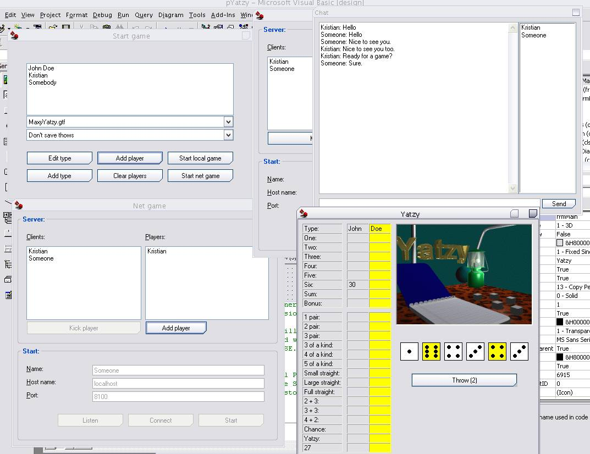



## Advanced Yatzy

### Description

As the name suggest, this is the famous, Yatzy, a game which is pretty easy to learn and play. In this application, i've included numerous functionalities; this include network-support with chat, a dynamic and very elaborative support of game-type (allowing users to make their own "levels" or variants of the game - Maxi-Yatzy and Normal Yatzy are included), plus a language skin. I've also managed to add support for plugins.
 
### More Info
 
Of some strange reason, the code seem to crash at closure on certain machines. I've tried to locate the problem, and it may be related to the mainfest-file. Removing that file might fix the problem.

             |
---                |---
**Submitted On**   |2005-04-19 22:45:52
**By**             |[Kristian S\. Stangeland](https://github.com/Planet-Source-Code/PSCIndex/blob/master/ByAuthor/kristian-s-stangeland.md)
**Level**          |Advanced
**User Rating**    |5.0 (10 globes from 2 users)
**Compatibility**  |VB 5\.0, VB 6\.0
**Category**       |[Games](https://github.com/Planet-Source-Code/PSCIndex/blob/master/ByCategory/games__1-38.md)
**World**          |[Visual Basic](https://github.com/Planet-Source-Code/PSCIndex/blob/master/ByWorld/visual-basic.md)
**Archive File**   |[Advanced\_Y1887595122005\.zip](https://github.com/Planet-Source-Code/kristian-s-stangeland-advanced-yatzy__1-60507/archive/master.zip)

### API Declarations

Too many to list here, i'm afraid.

